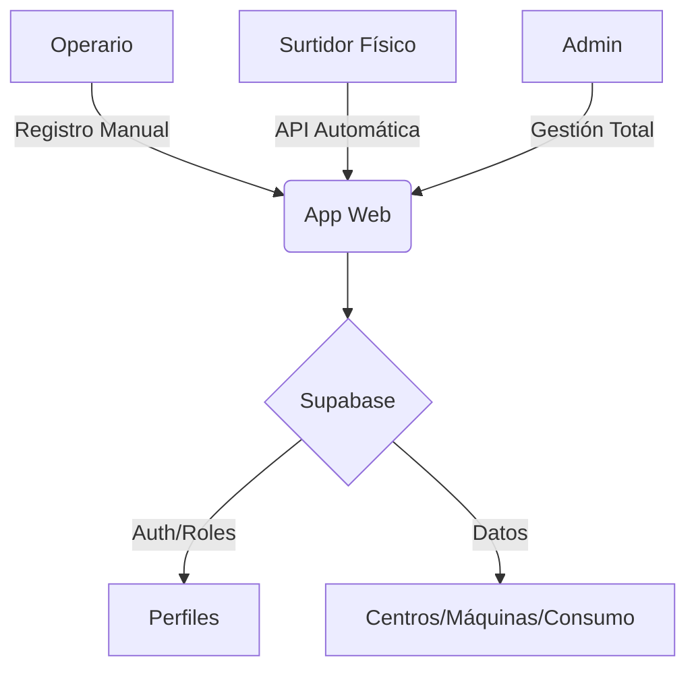
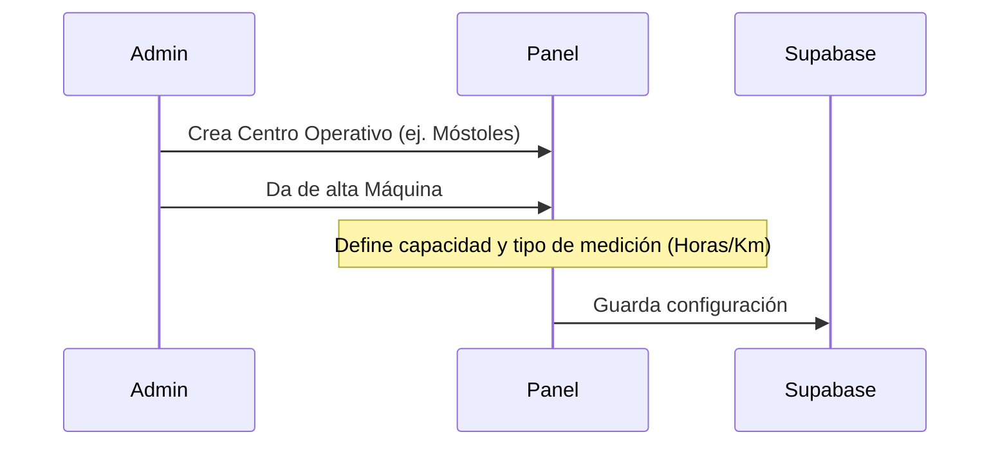

# Manual de Usuario: CTCFuelTrack ⛽

**CTCFuelTrack** es la solución integral de Veolia para la gestión, control y monitorización de repostajes de gasoil en tiempo real.

---

## 📊 Arquitectura del Sistema

---

## 📋 Índice

1. [Acceso y Seguridad](#-acceso-y-seguridad)
2. [Roles de Usuario](#-roles-de-usuario)
3. [Flujo de Administración (Admin)](#-flujo-de-administración-admin)
4. [Operaciones Diarias (Operario)](#-operaciones-diarias)
5. [Dashboard e Inteligencia de Datos](#-dashboard-e-inteligencia-de-datos)

---

## 🔐 Acceso y Seguridad

- **URL Personalizada**: Acceso desde cualquier dispositivo móvil o PC.
- **Autenticación Estricta**: Requiere correo corporativo y contraseña.
- **RLS (Row Level Security)**: Los datos están protegidos a nivel de base de datos; solo los autorizados pueden ver o modificar registros.

---

## 👥 Roles de Usuario

| Rol | Privilegios | Visualización |
|:---:|:---|:---|
| **Operario** | Registro de repostajes y visor de dashboard básico. | Menú simplificado. |
| **Admin** | Gestión de centros, máquinas, usuarios e historial total. | Menú de Administración completo + Badge Dorado. |

---

## ⚙️ Flujo de Administración (Admin)

### 1. Configuración de Centros y Máquinas
Antes de operar, el administrador debe definir la infraestructura:

### 2. Gestión de Usuarios
- En el panel de **Usuarios**, el administrador puede promover operarios a administradores con un solo clic.
- **Bajas**: El borrado de máquinas o centros incluye advertencias de borrado en cascada para evitar pérdida accidental de datos.

---

## ⛽ Operaciones Diarias

### Registro Manual (TPV)
El operario realiza el repostaje y lo registra inmediatamente:

1. **Selección**: Escoge la máquina por su código (ej. `EXC-001`).
2. **Litros**: Introduce la cantidad exacta.
3. **Lectura**: Introduce el contador actual (Horas o Km).
4. **Validación**: El sistema bloquea registros si superan la capacidad técnica del depósito.

---

## 📈 Dashboard e Inteligencia de Datos

El Dashboard es el corazón analítico de la aplicación:

### Gráfico de Tendencias
Visualiza el volumen de repostaje de los **últimos 15 días**. Permite identificar picos de actividad o consumos inusuales de forma visual.

### Filtros Inteligentes
- **Filtro por Centro**: Selecciona un centro operativo para que todas las tarjetas de estadísticas (Litros totales, Máquinas activas) y el gráfico se actualicen automáticamente para esa ubicación específica.

### Historial de Consumo (Admin)
- Tabla paginada con búsqueda avanzada por fecha y máquina.
- Eliminación de registros erróneos para mantener la integridad de los informes.

---

## 🚨 Soporte Técnico
Si encuentras errores de sesión o permisos:
1. Asegúrate de que tu usuario tiene asignado el perfil correcto en la sección de Administración.
2. Si la aplicación no carga, realiza un "Hard Refresh" (Ctrl + Shift + R).

---
*CTCFuelTrack - Veolia v1.2*
*Marzo 2026*
